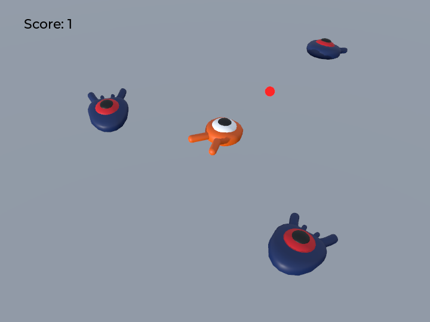

# Squash the Creeps 3D

A small 3D game made with **Godot 4.7**, built by following Godot's official
["Your first 3D game"](https://docs.godotengine.org/en/stable/getting_started/first_3d_game/index.html)
tutorial, plus our own addition: **shooting bullets**.

Dodge the creeps, squash them by jumping on top, or shoot them down.
Every creep you take out is worth 1 point. Touch one from the side and it's game over.

## Play

1. Download `SquashTheCreeps.exe` from the [latest release](https://github.com/JinLeeGG/Godot_3dgame_demo_team_ajapt/releases/latest).
2. Double-click to run. No Godot installation needed.
   - If Windows shows "Windows protected your PC", click **More info → Run anyway**
     (the exe is not code-signed).

Requires Windows 10/11 (64-bit) and a graphics card with Vulkan support.

## Controls

| Key | Action |
|---|---|
| <kbd>W</kbd><kbd>A</kbd><kbd>S</kbd><kbd>D</kbd> / Arrow keys | Move |
| <kbd>Space</kbd> | Jump (land on a creep to squash it) |
| <kbd>F</kbd> | Shoot a bullet |
| <kbd>Enter</kbd> | Retry after game over |

## How shooting works

The shooting feature is intentionally kept simple:

1. **Input** – pressing <kbd>F</kbd> triggers the `shoot` input action, which calls `shoot()` in `player.gd`.
2. **Direction** – the player remembers the last direction it moved in (`facing`), and the bullet flies that way.
3. **Spawn** – a new bullet is created from `bullet.tscn`, placed 1.5 m in front of the player, and added to the Main scene.
4. **Movement** – every frame the bullet moves `direction × speed × delta`, and deletes itself after 1 second.
5. **Hit** – when the bullet touches a creep, it calls the creep's `squash()`, the same function used when jumping on it.
   So the score goes up automatically, with no extra score code.

## Run from source

1. Install [Godot 4.7](https://godotengine.org/download).
2. Clone this repository and open `project.godot` in Godot.
3. Press <kbd>F5</kbd> to play.

To build the exe yourself: **Project → Export → Windows Desktop → Export Project**
(Godot will ask you to install the export templates the first time).

## Project structure

| File | What it does |
|---|---|
| `main.tscn` / `main.gd` | The game world: spawns creeps on a timer, handles game over and retry |
| `player.tscn` / `player.gd` | Player movement, jumping, squashing, and shooting |
| `mob.tscn` / `mob.gd` | A creep that walks across the arena and can be squashed |
| `bullet.tscn` / `bullet.gd` | The bullet: flies forward and kills creeps it touches |
| `score_label.gd` | Shows and updates the score |

## Credits

- Based on the [Godot "Your first 3D game" tutorial](https://docs.godotengine.org/en/stable/getting_started/first_3d_game/index.html)
  and its [demo project](https://github.com/godotengine/godot-demo-projects/tree/master/3d/squash_the_creeps).
- Music: "House In a Forest Loop" © 2012 [HorrorPen](https://opengameart.org/users/horrorpen),
  [CC-BY 3.0](https://creativecommons.org/licenses/by/3.0/).
  Source: https://opengameart.org/content/loop-house-in-a-forest
- Font: "Montserrat Medium" © 2011 [The Montserrat Project Authors](https://github.com/JulietaUla/Montserrat),
  SIL Open Font License 1.1 (see `fonts/LICENSE.txt`).
